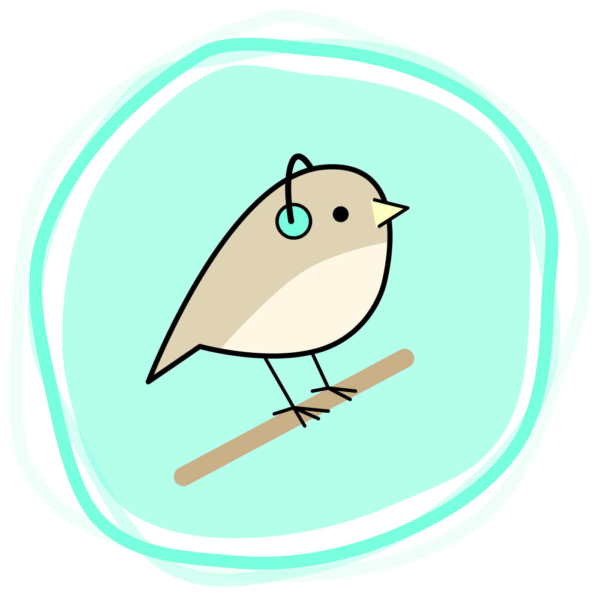

<p align="center">
  
</p>

# Birdy

## Architecture

Birdy consists of a few independantly scaleable services:

#### [`@birdy/recorder`](./services/recorder)

The `@birdy/recorder` service is reponsible for collecting audio from a single microphone in a specific location.

You should deploy as many `@birdy/recorder` services as you need.

#### [`@birdy/collector`](./services/collector)

The `@birdy/collector` service is responsible for gathering the raw recordings produced by the `@birdy/recorder` services and storing them in [Minio](https://min.io/).

You should only need to deploy a single `@birdy/collector` instance.

#### [`@birdy/analyzer`](./services/analyzer)

This is a future machine learning service that will use [BirdNET](https://github.com/kahst/BirdNET-Analyzer) to identify birds via the recordings recorded by `@birdy/recorder` and collected by `@birdy/collector`.

#### [`@birdy/api`](./services/api)

This is a future api to interact with the Birdy data.

#### [`@birdy/app`](./services/app)

This is a future web ui/app to view the data collected by Birdy.

## Developing

### macOS

To develop Birdy on macOS you'll need to install the `pulseaudio` package to allow us to listen to the microphone inside of Docker.

1. `brew install pulseaudio`
2. `vim /opt/homebrew/Cellar/pulseaudio/17.0/etc/pulse/default.pa`
    1. find `load-module module-native-protocol-tcp` and uncomment it, and then add `auth-ip-acl=127.0.0.1;192.168.0.0/24` after it, example:
        ```
        ### Network access (may be configured with paprefs, so leave this commented
        ### here if you plan to use paprefs)
        #load-module module-esound-protocol-tcp
        load-module module-native-protocol-tcp auth-ip-acl=127.0.0.1;192.168.0.0/24
        ```
3. start the `pulseaudio` server by running `pulseaudio --exit-idle-time=-1 --daemon`

### Other enviroments

I've not tested local dev on anything other then macOS. If you have, please update this README!
